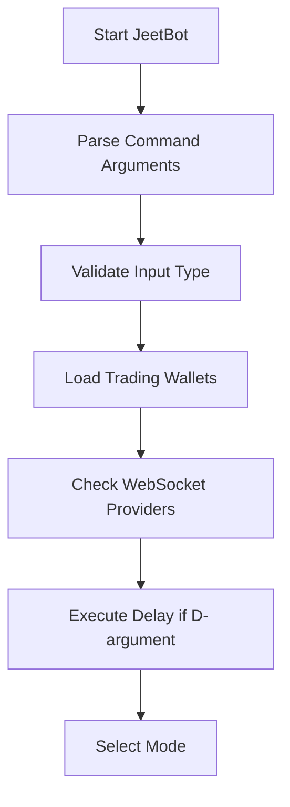
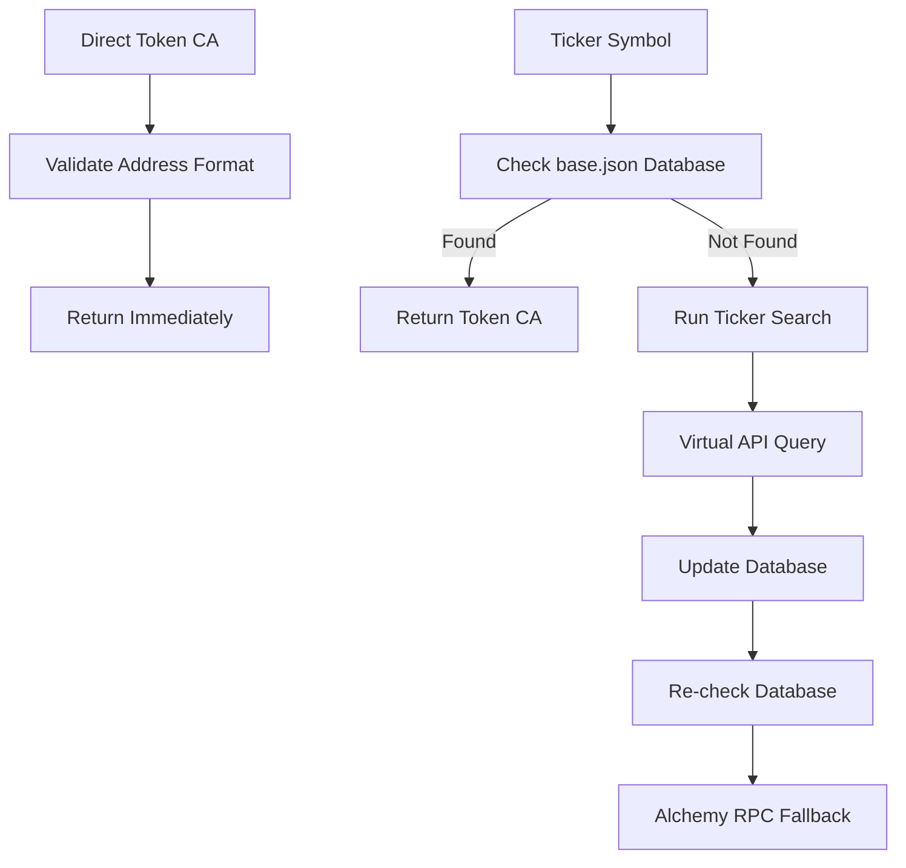
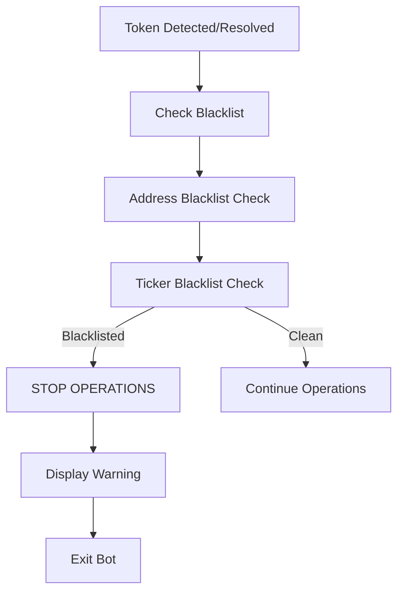
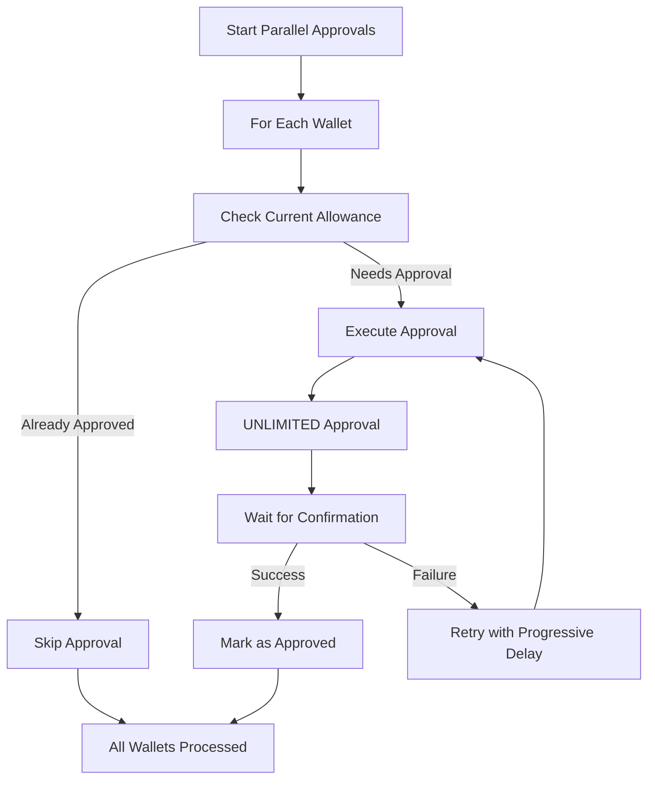
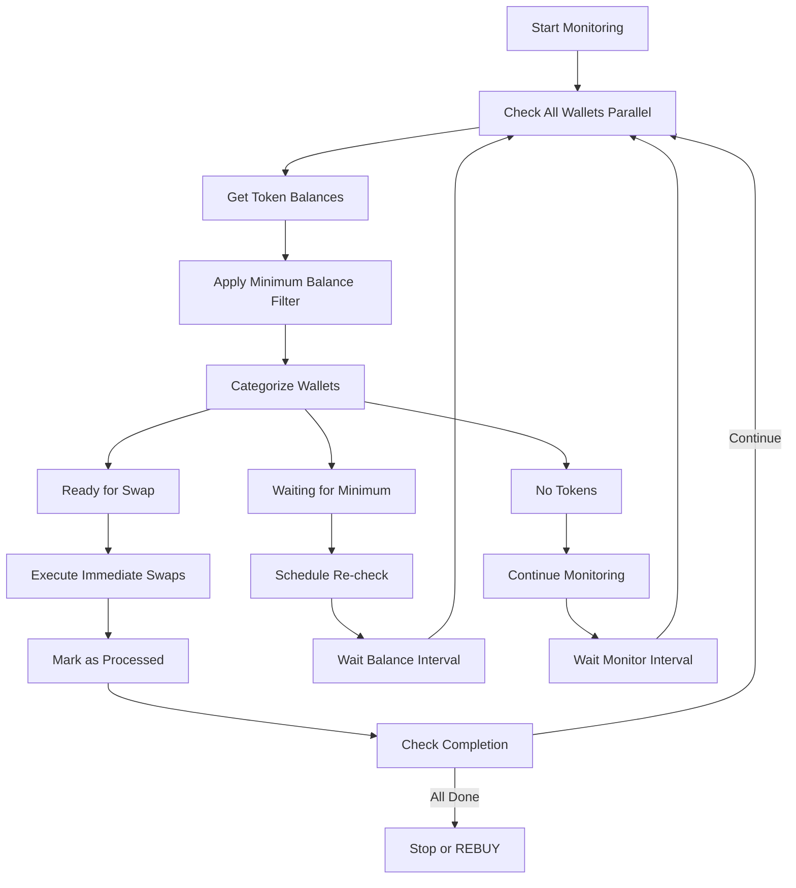
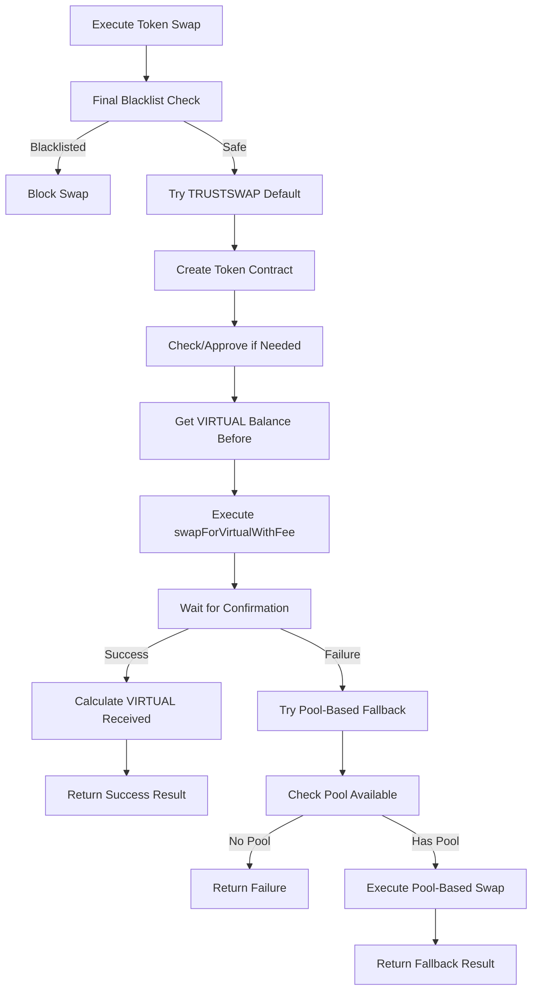
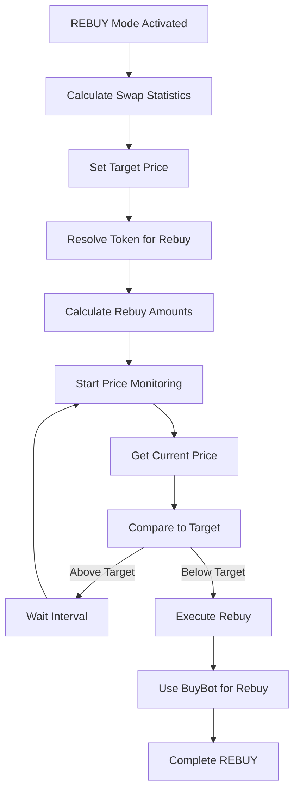
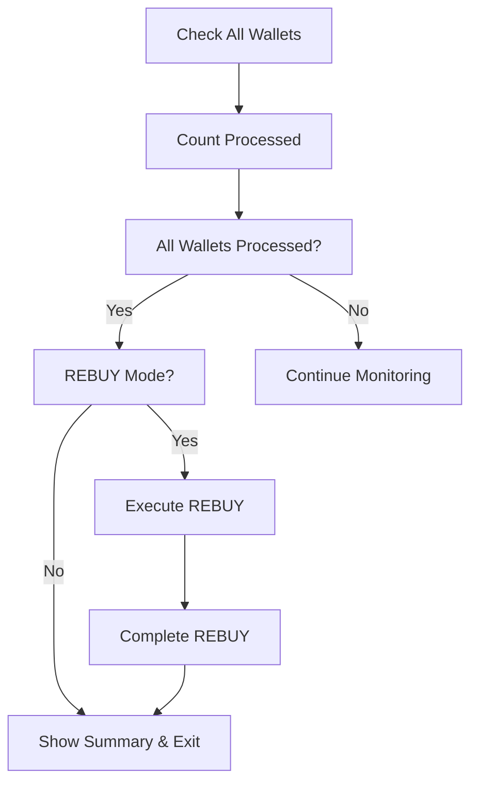
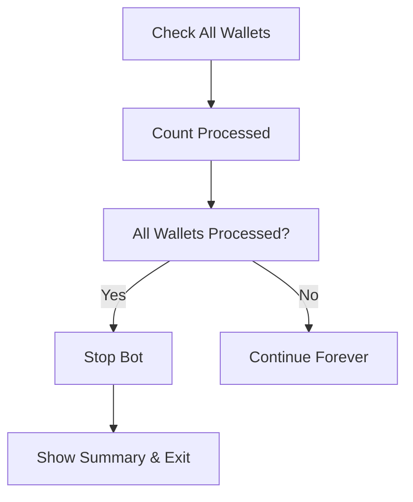

# JeetBot Complete Workflow & Logic Documentation

## Overview
JeetBot is a sophisticated cryptocurrency trading bot designed for automated token detection, claiming, and swapping operations. It consists of two main implementations:

1. **Main JeetBot Script** (`jeetbot.js`) - Command-line interface with multiple modes
2. **JeetBot Class** (`jeet-bot.js`) - Object-oriented implementation for programmatic use

## Architecture & Core Components

### 1. Input Types & Resolution
The bot supports three input types for token identification:

#### A. Genesis Contract Mode
- **Input**: Genesis contract address (0x...)
- **Purpose**: Detect new token deployments from Genesis contracts
- **Process**: WebSocket monitoring → Token CA detection → Operations

#### B. Direct Token CA Mode  
- **Input**: TOKEN-0x... (prefixed token contract address)
- **Purpose**: Direct token operations without detection
- **Process**: Immediate token operations

#### C. Ticker Symbol Mode
- **Input**: Ticker symbol (e.g., "VADER")
- **Purpose**: Resolve token from database/API
- **Process**: Database lookup → API search → Token resolution

### 2. Operating Modes

#### A. JEET Mode (Default)
**Purpose**: Full automated trading workflow
**Workflow**:
1. Token detection/resolution
2. Parallel approvals for TRUSTSWAP
3. Continuous token monitoring
4. Immediate swapping when conditions met
5. Optional REBUY mode

#### B. DETECT Mode
**Purpose**: Test token detection only
**Workflow**:
1. WebSocket detection for Genesis contracts
2. Token CA resolution for other input types
3. Blacklist warnings
4. No trading operations

#### C. CHECK Mode
**Purpose**: Balance verification
**Workflow**:
1. Token CA resolution
2. Wallet balance checking
3. Blacklist warnings
4. No trading operations

## Complete Workflow Analysis

### Phase 1: Initialization & Validation



**Key Validations**:
- Command line argument parsing
- Input type determination (Genesis/TOKEN-CA/Ticker)
- Wallet loading and validation
- WebSocket provider connectivity
- Delay execution (D-X minutes)
- REBUY mode parameter validation

### Phase 2: Token Detection & Resolution

#### Genesis Contract Detection
```mermaid
graph TD
    A[Genesis Contract Input] --> B[Pre-check: Token Already Exists?]
    B -->|Yes| C[Skip WebSocket Detection]
    B -->|No| D[Start WebSocket Monitoring]
    D --> E[Multiple Provider Polling]
    E --> F[10ms Retry Interval]
    F --> G[Contract.agentTokenAddress()]
    G -->|Zero Address| F
    G -->|Valid Address| H[Token Detected]
    H --> I[Log to genesis.json]
    I --> J[Return Token CA]
```

**Error Handling**:
- Provider failures: Automatic failover to other providers
- Network issues: Continuous retry with progressive delays
- Invalid responses: Skip and continue monitoring
- User interruption: Graceful shutdown with statistics

#### Token CA Resolution


**Fallback Mechanisms**:
1. **Database Lookup**: First check local base.json
2. **Ticker Search**: Query Virtual API for token data
3. **Alchemy RPC**: Direct blockchain queries
4. **Persistent Retry**: Continue until resolution or max attempts

### Phase 3: Blacklist Safety System



**Blacklisted Tokens**:
- **Addresses**: Hardcoded contract addresses (e.g., TRUST token)
- **Tickers**: Hardcoded ticker symbols
- **Safety**: Multiple check points throughout execution
- **Action**: Immediate bot termination with detailed warnings

### Phase 4: Parallel Approval System



**Approval Strategy**:
- **Target**: TRUSTSWAP contract (0xCa74C3115737D2f08bFe4D06127Dc2fdF22eaeb3)
- **Amount**: Unlimited (MaxUint256)
- **Gas**: Fixed 0.02 gwei, 200,000 gas limit
- **Retry**: Infinite retries with exponential backoff
- **Parallel**: All wallets processed simultaneously

### Phase 5: Advanced Token Monitoring



**Monitoring Configuration**:
- **Minimum Balance**: 100 tokens required before swapping
- **Re-check Interval**: 500ms (0.5 seconds) if minimum not met
- **Balance Strategy**: Sell 99.9% to avoid rounding errors
- **Completion Logic**: Different for Genesis vs TOKEN-CA/Ticker modes

### Phase 6: Token Swapping System

#### TRUSTSWAP Default Strategy


**Swap Parameters**:
- **Method**: TRUSTSWAP contract (0.25% fee)
- **Amount**: 99.9% of token balance
- **Slippage**: Handled internally by TRUSTSWAP
- **Gas**: Fixed 0.02 gwei, 600,000 gas limit
- **Fallback**: Pool-based swapping if TRUSTSWAP fails

### Phase 7: REBUY Mode (Optional)



**REBUY Configuration**:
- **Trigger**: X% price drop from swap price
- **Interval**: Configurable monitoring frequency (I-X minutes)
- **Amount**: (Virtual received - X%) + 5% buffer
- **Execution**: Uses BuyBot logic for token purchases

## Error Handling & Situation Management

### 1. Network & Provider Issues

**WebSocket Failures**:
- **Detection**: Multiple provider fallback
- **Action**: Switch to next available provider
- **Recovery**: Continuous retry until success

**RPC Failures**:
- **Detection**: Provider-specific error tracking
- **Action**: Automatic provider rotation
- **Recovery**: Persistent retry with progressive delays

### 2. Transaction Failures

**Approval Failures**:
- **Causes**: Insufficient ETH, nonce issues, network congestion
- **Action**: Infinite retry with exponential backoff
- **Recovery**: Progressive gas price increases

**Swap Failures**:
- **Primary**: TRUSTSWAP default method
- **Fallback**: Pool-based swapping
- **Final**: Mark as failed and continue

### 3. Balance & Timing Issues

**Minimum Balance Not Met**:
- **Action**: Continuous monitoring with re-check intervals
- **Genesis Mode**: Wait for balance increases
- **Other Modes**: Skip after processing

**Dust Amounts**:
- **Genesis Mode**: Continue monitoring for increases
- **Other Modes**: Skip to avoid infinite loops

### 4. Market Conditions

**High Slippage**:
- **TRUSTSWAP**: Handles slippage internally
- **Pool-based**: Uses calculated minimum output
- **Fallback**: Progressive slippage increases

**Liquidity Issues**:
- **Primary**: TRUSTSWAP (no pool required)
- **Secondary**: Pool-based (requires liquidity)
- **Failure**: Mark as failed, continue with other wallets

## Bot Completion Strategies

### Genesis Mode


### TOKEN-CA / Ticker Mode


## Configuration & Parameters

### Core Settings
- **Minimum Token Balance**: 100 tokens
- **Balance Re-check Interval**: 500ms
- **WebSocket Polling**: 10ms
- **Gas Price**: 0.02 gwei (fixed)
- **Slippage**: Managed by TRUSTSWAP

### REBUY Settings
- **Percentage**: User-defined (1-50%)
- **Interval**: User-defined (0.1-60 minutes)
- **Buffer**: +5% on rebuy amounts
- **Slippage**: 15% for rebuy operations

### Parallel Processing
- **Approvals**: All wallets simultaneously
- **Monitoring**: All wallets simultaneously
- **Swaps**: All ready wallets simultaneously

## Database & Logging

### Genesis Database (genesis.json)
- **Detection Events**: Timestamp, provider, duration
- **RPC Statistics**: Request counts, success rates
- **Provider Performance**: Individual provider metrics

### Balance Tracking
- **Before/After Snapshots**: Complete wallet states
- **Differences**: Calculated gains/losses
- **Summary Reports**: Final results display

### Error Logging
- **Timestamped Entries**: All operations logged
- **Debug Information**: Provider failures, retry attempts
- **Success Tracking**: Transaction hashes, gas usage

## Safety Features

### 1. Blacklist Protection
- **Hardcoded Lists**: Addresses and tickers
- **Multiple Checkpoints**: Throughout execution
- **Immediate Termination**: No trading of blacklisted tokens

### 2. Balance Protection
- **99.9% Selling**: Avoid rounding errors
- **Minimum Requirements**: Prevent dust transactions
- **Continuous Monitoring**: Real-time balance checks

### 3. Gas Management
- **Fixed Pricing**: Prevents gas auction participation
- **Appropriate Limits**: Sufficient for complex operations
- **Legacy Format**: Ensures compatibility

### 4. Graceful Shutdown
- **Ctrl+C Handling**: Clean termination
- **Final Summaries**: Complete operation reports
- **Resource Cleanup**: Proper connection closing

## Integration Points

### External Dependencies
- **TRUSTSWAP Contract**: Primary trading mechanism
- **Uniswap V2 Router**: Fallback trading
- **WebSocket Providers**: Real-time blockchain data
- **Database Systems**: Token resolution and logging

### Bot Ecosystem
- **SellBot**: Shares wallet configuration
- **BuyBot**: Used for REBUY operations
- **TickerBot**: Token search and resolution
- **Balance Tracker**: Comprehensive reporting

This documentation provides a complete understanding of JeetBot's architecture, workflow, and situation handling capabilities. The bot is designed for robustness, with multiple fallback mechanisms and comprehensive error handling to ensure reliable operation in various market conditions. 